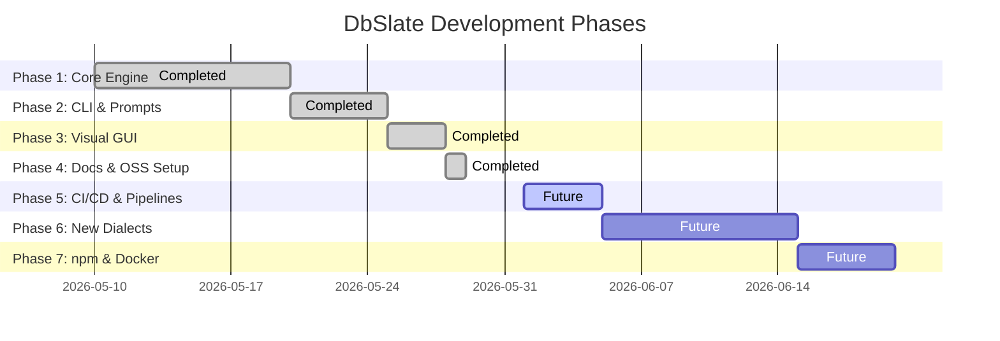

# DbSlate Project Roadmap & Phased Implementation Plan

This document outlines the development phases, architectural checkpoints, and future milestone checklist for the DbSlate open-source project.

---

## 🗺️ Phased Implementation Checklist

---

### Phase 1: Core Introspection & Diff Engine (Completed)

- [x] Create language-agnostic JSON-based standard database schema schema ([`types.ts`](file:///c:/Users/awwal/Documents/work/hobby/database/core/types.ts))
- [x] Build SQLite metadata PRAGMA catalog parser ([`sqlite.ts`](file:///c:/Users/awwal/Documents/work/hobby/database/core/introspect/sqlite.ts))
- [x] Build PostgreSQL information_schema and relational catalog query runner ([`postgres.ts`](file:///c:/Users/awwal/Documents/work/hobby/database/core/introspect/postgres.ts))
- [x] Build table/column/index/relationship diff logic engine ([`engine.ts`](file:///c:/Users/awwal/Documents/work/hobby/database/core/diff/engine.ts))
- [x] Compile PostgreSQL DDL syntax generator ([`postgres-generator.ts`](file:///c:/Users/awwal/Documents/work/hobby/database/core/diff/postgres-generator.ts))
- [x] Implement SQLite advanced table-rebuild generator for safe alter actions ([`sqlite-generator.ts`](file:///c:/Users/awwal/Documents/work/hobby/database/core/diff/sqlite-generator.ts))
- [x] Code model generator support for TypeScript, C#, Python, and Go ([`models.ts`](file:///c:/Users/awwal/Documents/work/hobby/database/core/generate/models.ts))

### Phase 2: CLI Utility & Option B Warning Guards (Completed)

- [x] Create entry subcommand router for `introspect`, `diff`, `apply`, and `generate` ([`bin.ts`](file:///c:/Users/awwal/Documents/work/hobby/database/cli/bin.ts))
- [x] Integrate Node's native `readline` module for interactive prompts on destructive SQL modifications
- [x] Implement Option B DDL filter: lock dropping columns/tables behind explicit console checkboxes

### Phase 3: Visual Web GUI Designer Dashboard (Completed)

- [x] Scaffold Next.js workspace with custom Vanilla CSS styles ([`globals.css`](file:///c:/Users/awwal/Documents/work/hobby/database/web/app/globals.css))
- [x] Design glassmorphic dark-theme connection panel ([`page.tsx`](file:///c:/Users/awwal/Documents/work/hobby/database/web/app/page.tsx))
- [x] Build visual database designer grid to add tables, edit columns, and link FKs/indexes ([`dashboard/page.tsx`](file:///c:/Users/awwal/Documents/work/hobby/database/web/app/dashboard/page.tsx))
- [x] Create live side-by-side DDL migration diff preview
- [x] Design visual Option B confirmation lock-boxes for destructive operations (disabling blocks until verified)
- [x] Create server api route endpoints to bridge client dashboard actions with core engine helpers

### Phase 4: Open Source Launch Documentation & Assets (Completed)

- [x] Draft `README.md` with system architecture diagrams
- [x] Define contribution protocols, directory scopes, and conventional commit rules (`CONTRIBUTING.md`)
- [x] Add Contributor Covenant guidelines (`CODE_OF_CONDUCT.md`)
- [x] Create developer template checklist (`PULL_REQUEST_TEMPLATE.md`)
- [x] Establish official open-source license ([`LICENSE`](file:///c:/Users/awwal/Documents/work/hobby/database/LICENSE) under MIT License)

### Phase 5: Testing Automation & CI/CD Pipelines (Planned)

- [ ] Set up GitHub Actions CI workflow to verify:
  - Strict TypeScript compilation across all packages on PR commits
  - Automatic test suites execution via `npm run test`
  - ESLint syntax inspections
- [ ] Configure automatic code coverage reports upload (e.g. Codecov)
- [ ] Design dependency auto-updates config (e.g. Dependabot)

### Phase 6: Multi-Dialect Dialect Expansion (Planned)

- [ ] Add **MySQL & MariaDB** dialect compatibility:
  - Write `core/introspect/mysql.ts` to inspect MySQL information schema tables
  - Write `core/diff/mysql-generator.ts` to format MySQL-compatible DDL migrations
- [ ] Add **MSSQL (SQL Server)** dialect compatibility:
  - Write MSSQL schema query loader
  - Generate T-SQL compliant output scripts

### Phase 7: Distribution & Containerization (Planned)

- [ ] Publish `@dbslate/core` and `@dbslate/cli` packages to npm
- [ ] Package the Web App GUI into a lightweight Docker container image for offline docker-compose deployment
- [ ] Setup a static Next.js documentation portal hosted on GitHub Pages or Vercel
